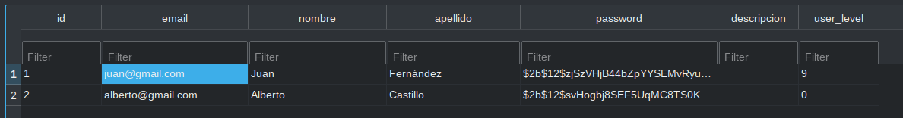
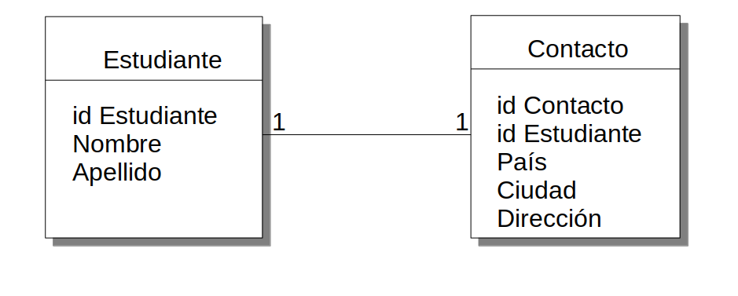
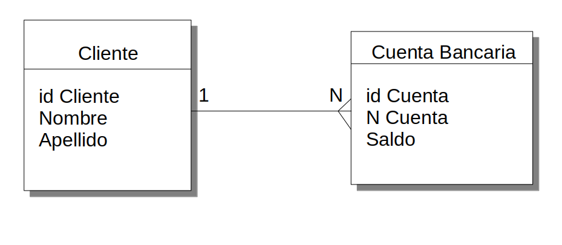
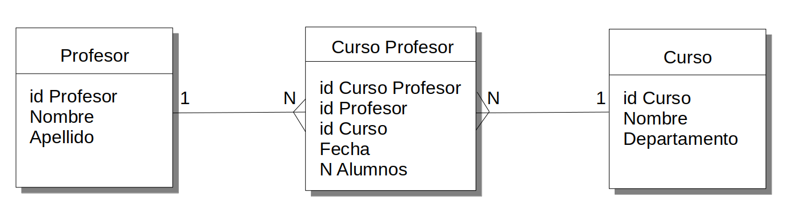
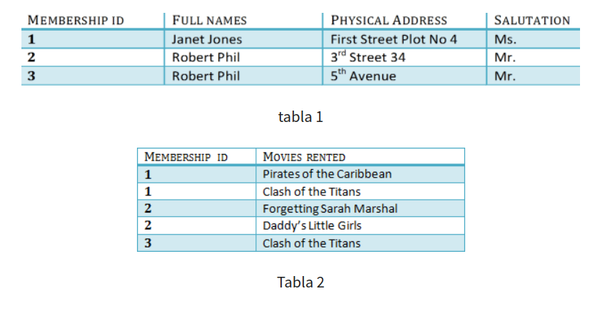
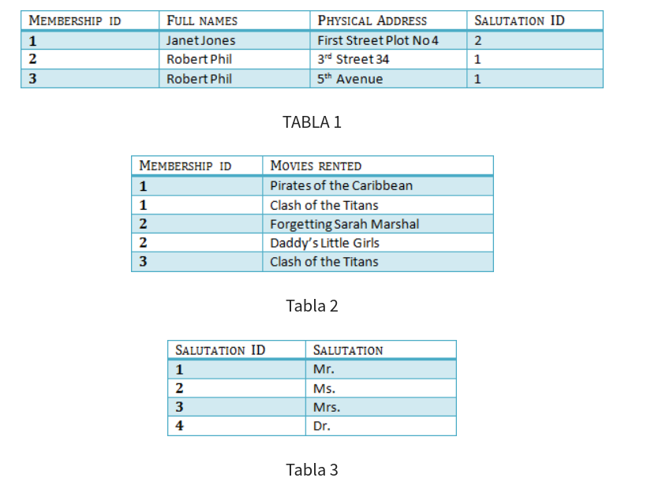

# Structured Query Language (SQL)

- Es un lenguaje diseñado para acceder y manipular bases de datos relacionales (RDBMS-Relational Data Base Managemente System).
- A pesar de ser un lenguaje estándar ANSI/ISO, existen diferentes versiones de SQL, cada una con pequeñas variaciones según el motor de base de datos que se esté utilizando.

## Gestores de base de datos relacionales (RDBMS)

- Se les llama gestores de base de datos a aquellos sistemas encargados en mantener las relaciones presentes y su mantención en una base de datos.
- Los gestores relacionales son aquellos que internamente almacenan sus datos utilizando un modelo relacional. Este organiza los datos de la siguiente manera:
    - Los datos se almacenan en una o más tablas (relaciones)
    - Cada tabla contiene una o más filas y columnas
    - Cada fila representa un registro, las cuales contienen un identificador único.
    - Cada columna representa los atributos (características de los datos almacenados)
- Existen múltiples gestores de base de datos relacionales. Entre ellos:
    - MySQL
    - MariaDB
    - SQLite
    - PostgreSQL
    - SQLServer
    - Oracle
    - Un largo etc.
- En este bootcamp, utilizaremos MySQL.

# Modelo ER (Entidad Relación)
Las bases de datos relacionales ordenan sus datos en conjuntos de elementos llamados **tablas**. Cada tabla a su vez está compuesta por **columnas**, que contienen las características almacenadas para cada dato perteneciente en la tabla, y **filas**, las cuales corresponden a los datos propiamente tales.



Una base de datos relacional permite que los datos almacenados en distintas tablas puedan **relacionarse** entre sí. Esto permite acceder a datos conectados entre tablas fácilmente. 

Existen múltiples tipos de relaciones entre tablas: Uno a uno, uno a muchos y muchos a muchos

## Relaciones uno a uno

Cada registro de una tabla A está relacionado con solo un registro de una tabla B.



## Uno a muchos

Cada registro de una tabla A puede estar relacionado con múltiples registros de una tabla B.



## Muchos a muchos

Cada registro de una tabla A puede estar relacionado con múltiples registros de una tabla B y viceversa. 



## Normalización

La normalización es el proceso que se aplica para el diseño de una base de datos de manera de minimizar la redundancia entre datos.
Consideremos los siguientes datos sin normalizar (forma normal cero 0NF)


### Primera forma normal 1NF
- Cada campo de tu tabla debe ser un elemento atómico (indivisible)


### Segunda forma normal 2NF
- Evitar datos repetidos a través de una tabla externa y llave foránea. La tabla a normalizar ya debe estar en 1NF.



### Tercera forma normal 3NF
- Evitar dependencias transitivas entre columnas de una misma tabla. La tabla a normalizar ya debe estar en 2NF.




# MySQL

## 1 Instalación

```console
(DjangoVenv)$ sudo apt install mysql-server
```

(Revisar plataforma de Coding Dojo para otros sistemas operativos)

## 2 Comandos de uso común 

(Referencia: https://programmerclick.com/article/3885696599/)

Conexión
```bash
mysql -u root -p

// crear base de datos
create database name; 

 // Seleccione la base de datos
use databasename; 

 // Eliminar la base de datos directamente sin recordar
drop database name; 

 // mostrar tabla
show tables; 

 // Descripción detallada de la tabla.
describe tablename; 

 seleccionar agrega distinto para eliminar campos duplicados

 // Antes de eliminar la base de datos, hay un mensaje
mysqladmin drop databasename 

 // Muestra la versión actual de mysql y la fecha actual
select version(),current_date;

```

## 3 Creación de Base de datos

```console
mysql@localhost$ mysql -u user -p
Enter password: 
Welcome to the MySQL monitor.  Commands end with ; or \g.
Your MySQL connection id is 14
Server version: 8.0.26-0ubuntu0.20.04.3 (Ubuntu)

Copyright (c) 2000, 2021, Oracle and/or its affiliates.

Oracle is a registered trademark of Oracle Corporation and/or its
affiliates. Other names may be trademarks of their respective
owners.

Type 'help;' or '\h' for help. Type '\c' to clear the current input statement.

mysql> create database myenterprise;
Query OK, 1 row affected (0,01 sec)

mysql> show databases;
+--------------------+
| Database           |
+--------------------+
| information_schema |
| myenterprise       |
| mysql              |
| performance_schema |
| sys                |
+--------------------+
5 rows in set (0,01 sec)

mysql> use myenterprise;
Database changed
mysql>
```

## 4 Creación de tablas

```console
mysql> create table App1_cliente (id MEDIUMINT NOT NULL AUTO_INCREMENT, nombre VARCHAR(20), run BIGINT, dv INT, PRIMARY KEY (id));      
Query OK, 0 rows affected (0,08 sec)
mysql> desc App1_cliente;
+--------+-------------+------+-----+---------+----------------+
| Field  | Type        | Null | Key | Default | Extra          |
+--------+-------------+------+-----+---------+----------------+
| id     | mediumint   | NO   | PRI | NULL    | auto_increment |
| nombre | varchar(20) | YES  |     | NULL    |                |
| run    | bigint      | YES  |     | NULL    |                |
| dv     | int         | YES  |     | NULL    |                |
+--------+-------------+------+-----+---------+----------------+
4 rows in set (0,01 sec)

mysql> create table App1_cuenta(
    -> n_cuenta MEDIUMINT NOT NULL AUTO_INCREMENT,
    -> person_id MEDIUMINT NOT NULL,
    -> saldo int,
    -> PRIMARY KEY(n_cuenta),
    -> FOREIGN KEY(person_id) REFERENCES App1_cliente(id)
    -> );
Query OK, 0 rows affected (0,05 sec)

mysql> desc App1_cuenta;
+-----------+-----------+------+-----+---------+----------------+
| Field     | Type      | Null | Key | Default | Extra          |
+-----------+-----------+------+-----+---------+----------------+
| n_cuenta  | mediumint | NO   | PRI | NULL    | auto_increment |
| person_id | mediumint | NO   | MUL | NULL    |                |
| saldo     | int       | YES  |     | NULL    |                |
+-----------+-----------+------+-----+---------+----------------+
3 rows in set (0,02 sec)


```

## 5 Sentencias básicas MySQL

Referencia: https://dev.mysql.com/doc/refman/8.0/en/sql-data-manipulation-statements.html


### **5.1 Insert**

```sql
insert into nombre_tabla (columna1, columna2, columna3) values (valor1, valor2, valor3);
```

Ejemplo: 

```console
mysql> insert into App1_cliente (nombre, run, dv) values ('Patricio', 11111111, 1), ('Juan', 2222222, 2);
Query OK, 2 rows affected (0,01 sec)
Records: 2  Duplicates: 0  Warnings: 0

```

### **5.2 Select**

```sql
select columna1, columna2 from nombre_tabla where condición;
```

Ejemplo:

```console
mysql> select run from App1_cliente where nombre="Patricio";
+----------+
| run      |
+----------+
| 11111111 |
+----------+
1 row in set (0,01 sec)


```

### **5.3 Update**

```sql
update nombre_tabla set columna1=valor1 and columna2=valor2 where columna3=valor3;

```

Ejemplo: 

```console
mysql> update App1_cliente set nombre="Patricio Olivares" where run=11111111;
Query OK, 1 row affected (0,01 sec)
Rows matched: 1  Changed: 1  Warnings: 0

mysql> select * from App1_cliente;
+----+-------------------+----------+------+
| id | nombre            | run      | dv   |
+----+-------------------+----------+------+
|  1 | Patricio Olivares | 11111111 |    1 |
|  2 | Juan              |  2222222 |    2 |
+----+-------------------+----------+------+
2 rows in set (0,00 sec)
```

### **5.4 Delete**

```sql
delete from nombre_tabla where condicion;

```

Ejemplo: 

```console
mysql> delete from App1_cliente where run=11111111;
Query OK, 1 row affected (0,01 sec)
mysql> select * from App1_cliente;
+----+--------+---------+------+
| id | nombre | run     | dv   |
+----+--------+---------+------+
|  2 | Juan   | 2222222 |    2 |
+----+--------+---------+------+
1 row in set (0,00 sec)

```

### **5.5 Join**

Join permite combinar datos entre tablas que tengan una o más columnas en común. El Join puede ser de tipo

1. **Inner Join:** Devuelve los datos que se encuentren en ambas columnas (intersección)
2. **Left Join:** Agrega a la tabla de la izquierda la información contenida en la tabla derecha.
3. **Right Join:** Agrega a la tabla de la detecha la información contenida en la tabla izquierda.

Ejemplo:

```console
mysql> insert into App1_cliente (nombre, run, dv) values ('Alfonso', 33333333, 3), ('Constanza', 44444444, 4);
Query OK, 2 rows affected (0,01 sec)
Records: 2  Duplicates: 0  Warnings: 0

mysql> insert into App1_cuenta (n_cuenta, saldo, person_id) values (1, 10000, 2), (2, 10000, 2), (3, 50000, 3);
Query OK, 3 rows affected (0,01 sec)
Records: 3  Duplicates: 0  Warnings: 0

mysql> select nombre, run, n_cuenta, saldo from App1_cliente join App1_cuenta on App1_cliente.id=person_id;
+---------+----------+----------+-------+
| nombre  | run      | n_cuenta | saldo |
+---------+----------+----------+-------+
| Juan    |  2222222 |        1 | 10000 |
| Juan    |  2222222 |        2 | 10000 |
| Alfonso | 33333333 |        3 | 50000 |
+---------+----------+----------+-------+
3 rows in set (0,00 sec)

mysql> select nombre, run, n_cuenta, saldo from App1_cliente left join App1_cuenta on App1_cliente.id=person_id;
+-----------+----------+----------+-------+
| nombre    | run      | n_cuenta | saldo |
+-----------+----------+----------+-------+
| Juan      |  2222222 |        1 | 10000 |
| Juan      |  2222222 |        2 | 10000 |
| Alfonso   | 33333333 |        3 | 50000 |
| Constanza | 44444444 |     NULL |  NULL |
+-----------+----------+----------+-------+
4 rows in set (0,00 sec)

```

---


# Fuentes
[https://es.myservername.com/database-normalization-tutorial](https://es.myservername.com/database-normalization-tutorial)

[https://en.wikipedia.org/wiki/Normalization](https://en.wikipedia.org/wiki/Normalization)

[https://guru99.es/database-normalization/](https://guru99.es/database-normalization/)