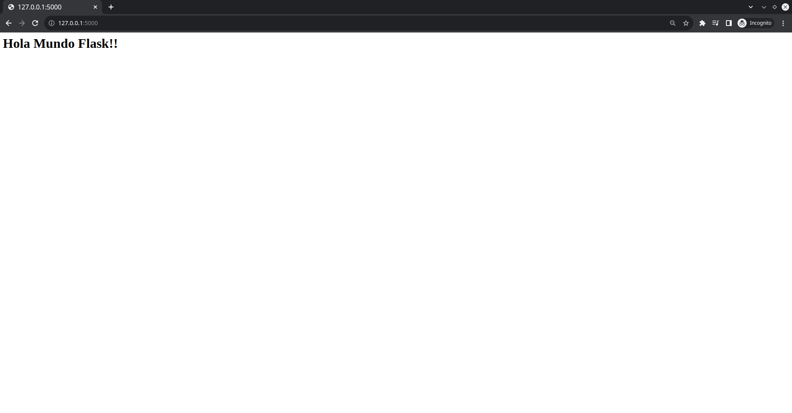

# Guía para creación de proyecto en Flask

El presente documento servirá como una guía rápida para la creación de proyectos utilizando el framework Flask utilizando sus elementos básicos del mismo.
Instalación probada sobre entorno Ubuntu 20.04, python 3.8.8 y Flask 2.1.1

La estructura de esta guía se presenta a continuación:

<div id="indice" />

**Índice**

0. [¿Qué es Flask?](#paso0)
1. [Creación de un entorno virtual](#paso1)
2. [Instalación de Flask sobre entorno virtual](#paso2)
3. [Primer proyecto Flask: MyEnterprise](#paso3)
4. [Rutas Flask](#paso4)
5. [Renderizado de vistas](#paso5)
6. [Archivos estáticos](#paso6)
7. [Solicitudes GET y POST en Flask](#paso7)
8. [Sesiones en Flask](#paso8)

---

<div id='paso0' />

## 0. ¿Qué es Flask?
Flask es un framework para desarrollo web basado en el lenguaje de programación Python. Este contiene un conjunto de bibliotecas y módulos que facilitan la creación de una aplicación web.
A diferencia de otros frameworks como Django, Flask se denomina como "microframework". Es decir, es un framework cuyo código es compacto y simple.

[Volver al índice](#indice)

---

<div id='paso1' />

## 1. Creación de un entorno virtual

En la carpeta donde se desee crear el nuevo entorno virtual

```console
$ python -m venv FlaskVenv
```

Esto creará un entorno virtual en la carpeta actual

```console
$ ls
FlaskVenv/
```

Activación del entorno virtual

```console
$ source FlaskVenv/bin/activate
(FlaskVenv) $ 
```

[Volver al índice](#indice)

---

<div id='paso2' />

## 2. Instalación de Flask sobre entorno virtual

```console
(FlaskVenv)$ pip install flask
```
**Ojo**, es necesario tener activado el entorno virtual antes de instalar bibliotecas.

[Volver al índice](#indice)

---

<div id='paso3' />

## 3. Primer proyecto Flask: MyEnterprise

Crearemos una nueva carpeta para almacenar nuestro proyecto

```console
(FlaskVenv)$ mkdir MyEnterprise # Creamos la carpeta HolaMundo/ para almacenar nuestro proyecto
(FlaskVenv)$ cd MyEnterprise/ # Entramos en dicha carpeta
(FlaskVenv)$ pwd # Ubicación actual
/ruta/completa/del/proyecto/MyEnterprise/
```
Dentro de nuestra carpeta *MyEnterprise/*, crearemos un archivo que contendrá el siguiente código

```python 
# Filename: app.py

from flask import Flask # Importamos la clase Flask

app = Flask(__name__) # Creamos una instancia de la clase Flask

@app.route('/') # Decorador de ruta
def index(): # Función que se ejecuta cuando se accede a la ruta raíz
    return "<h1>Bienvenidos a MyEnterprise!!</h1>" # Devolvemos una cadena de texto

if __name__ == "__main__": # Se asegura de que este archivo se ejecute directamente y no desde un módulo diferente
    app.run(debug=True) # Ejecutamos la aplicación en modo depuración
```

Ejecutaremos dicha aplicación web de la siguiente manera

```console
(FlaskVenv)$ python app.py 
 * Serving Flask app 'app' (lazy loading)
 * Environment: production
   WARNING: This is a development server. Do not use it in a production deployment.
   Use a production WSGI server instead.
 * Debug mode: on
 * Running on http://127.0.0.1:5000 (Press CTRL+C to quit)
 * Restarting with stat
 * Debugger is active!
 * Debugger PIN: 354-578-240
```

Ingresamos a la url http://127.0.0.1:5000/ indicada para verificar el correcto funcionamiento del servidor



[Volver al índice](#indice)

---

<div id='paso4' />

## 4. Rutas Flask
Cada ruta en Flask se identifica con una función y un decorador (@). Los decoradores son elementos que permiten modificar (decorar) el comportamiento de una función python. Pueden leer más información respecto a decoradores en el enlace https://codigofacilito.com/articulos/decoradores-python


```python
# Filename: app.py

# Agregaremos las rutas description/ y contact/office. Cada una de ellas estará asociada a una función
# distinta
@app.route('/description')
def description():
    return "<h1>Página de descripcion</h1>"

@app.route('/contact/office/')
def contact():
    return "<h1>Datos de contacto oficina: +56 9 11111111 </h1>"
```

Las rutas también permiten valores de entrada.

```python
# Ruta para saludar a un usuario según su nombre, apelido y edad.
@app.route('/hola/<nombre>/<apellido>/<int:edad>')
def hola(nombre, apellido, edad):
    return "<h1>Hola {0} {1} de {2} años</h1>".format(nombre, apellido, edad)
```

[Volver al índice](#indice)

---

<div id='paso5' />

## 5. Renderizado de vistas

Hasta el momento, hemos visualizado los contenidos de cada página directamente como returns de textos en cada función Flask. Podemos reutilizar códigos html para generar cada página en un proceso que se llama *renderizado*. Para ello, debemos importar la clase Flask y la clase render_template.

Primero, debemos agregar la función de renderizado desde Flask
```python
from flask import Flask, render_template  # Importamos la clase Flask
```
Luego, aplicaremos la función de renderizado en una ruta
```python
# Ejemplo de renderizado de plantillas
@app.route('/user/<nombre>/<apellido>/<int:edad>')
def user(nombre, apellido, edad):
    return render_template('user.html', nombre=nombre, apellido=apellido, edad=edad)
```

*render_template* es la función encargada del renderizado utilizando un archivo .html como base. Los parámetros *nombre*, *apellido* y *edad* serán pasados a la plantilla. Nótese que la plantilla debe estar en la carpeta *templates*.

El código html dentro del archivo *user.html* es el siguiente

```html
<!DOCTYPE html>
<html lang="en">
<head>
    <meta charset="UTF-8">
    <meta http-equiv="X-UA-Compatible" content="IE=edge">
    <meta name="viewport" content="width=device-width, initial-scale=1.0">
    <title>Usuario</title>
</head>
<body>
    Bienvenido usuario {{nombre}} {{apellido}}, su edad es {{edad}}
</body>
</html>
```
Para acceder a los parámetros entregados a la plantilla, se utiliza la sintaxis *jinja* (más información en el enlace https://jinja.palletsprojects.com/en/3.1.x/templates/). Jinja es un motor de plantillas que permite generar código html dinámicamente utilizando sintaxis de python. En este caso, se utiliza la sintaxis *{{}}* para acceder a los parámetros enviados a la plantilla.

Otro ejemplo de uso de jinja es el siguiente

```python
# Ejemplo de jinja: repetición de texto
@app.route('/repeat/<int:num>/<string:texto>')
def repeat(num, texto):
    return render_template('repeat.html', num=num, texto=texto)
```

```html
<!DOCTYPE html>
<html lang="en">
<head>
    <meta charset="UTF-8">
    <meta http-equiv="X-UA-Compatible" content="IE=edge">
    <meta name="viewport" content="width=device-width, initial-scale=1.0">
    <title>Repeat texto</title>
</head>
<body>
    
        <p>Repetición {{i + 1}} del texto ingresado: {{texto}}</p>
    
</body>
</html>
```

[Volver al índice](#indice)

---

<div id='paso6' />

## 6. Archivos estáticos

Flask permite la utilización de archivos estáticos. Estos son archivos que no se modifican y que no se deben modificar. Por ejemplo, una imagen, un archivo de audio, un archivo de video, etc. También cae dentro de esta categoría archivos *.css* y *.js*.
En Flask, los contenidos estáticos deben encontrarse en una carpeta de nombre *static*. Estos se pueden acceder desde las plantillas html como se muestra en el siguiente ejemplo

```python
# Ejemplo de jinja para archivos estáticos
@app.route('/president/')
def president():
    return render_template('president.html')

```

```html
<!DOCTYPE html>
<html lang="en">
<head>
    <meta charset="UTF-8">
    <meta http-equiv="X-UA-Compatible" content="IE=edge">
    <meta name="viewport" content="width=device-width, initial-scale=1.0">
    <title>CEO de MyEnterprise</title>
</head>
<body>
    <h1>Señor Totó, CEO de MyEnterprise</h1>
    
</body>
</html>
```

[Volver al índice](#indice)

---

<div id='paso7' />

## 7. Solicitudes GET y POST en Flask

Crearemos una nueva vista que reciba request *GET* y *POST*. Para ello, utilizaremos el parámetro de entrada de nuestra vista *request*. Utilizando esta variable, podremos determinar qué tipo de solicitud ha sido enviada y cuales son los datos enviados en dicha solicitud.
Ejemplificaremos el uso de solicitudes tipo *GET* y *POST* en una aplicación para registros de grupos de presentación. El código de dicho proyecto se encuentra en la carpeta *RegistroGrupos/* del repositorio de GitHub.

[Volver al índice](#indice)

---

<div id='paso8' />

## 8. Sesiones en Flask

Una sesión corresponde a un conjunto de datos que se almacena en el servidor asociada a la conexión existente entre un cliente y un servidor. 
Crearemos una sencilla aplicación de login para probar la funcionalidad de sesiones. Este código se encuentra en la carpeta *Sesion/* del repositorio de GitHub.

[Volver al índice](#indice)

---

# Fuentes adicionales
- https://pythonbasics.org/what-is-flask-python/

