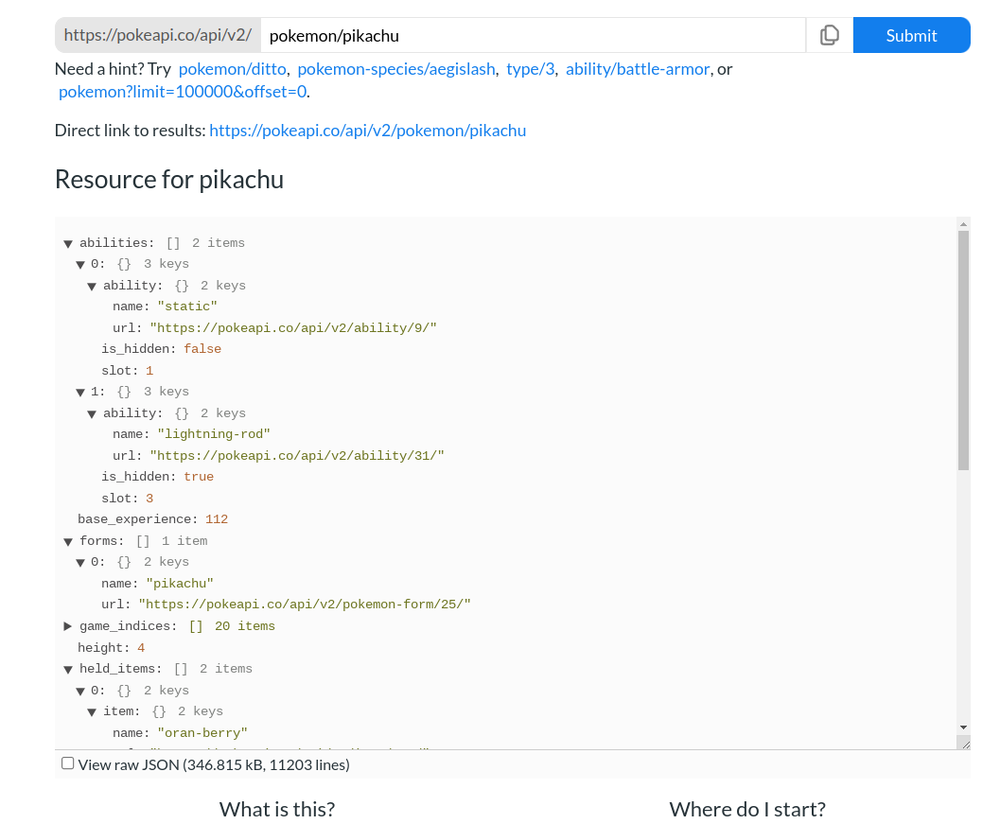

# APIs y AJAX

## API
API (Application Programming Interface) es una interfaz de programación que permite comunicarse con una aplicación. 
Cada API tiene una forma de comunicarse, pero por lo general es una URL a la que se accede mediante una petición HTTP.

Ejemplo API Pokemon: https://pokeapi.co/. Esta API nos permite acceder a la información de los pokemones de la API a través de información enviada en una URL. El resultado de la petición HTTP es un JSON con la información del pokemon.



En Python, se puede acceder a la información de una API a través de la biblioteca requests, la cual debe ser instalada previamente.

```console
(FlaskVenv)$ pip install requests
```

Ejemplo de uso API Pokemon en Python Flask:

```python
from flask import Flask
import requests

app = Flask(__name__)

@app.route('/pokemon/<string:pokemon>')
def pokemon(pokemon):
    url = 'https://pokeapi.co/api/v2/pokemon/' + pokemon
    response = requests.get(url)
    return response.json()

if __name__=='__main__':
    app.run(debug=True)
```

En ocasiones, una API requiere de llaves para acceder a sus datos. Esta llave esta asociada generalmente a una cuenta de usuario.

Cada API tiene definidas sus propias solicitudes. Cada una de estas solicitudes puede ser estudiada a través de la documentación de la API. (Ejemplo: Documentación API Pokemon https://pokeapi.co/docs/v2.html).

También es posible crear nuestras propias APIs en Flask y acceder a ellas mediante una URL. En el ejemplo de Pokemon, nuestra ruta */pokemon/<string:pokemon>* nos permite acceder a la información de un pokemon, transformando esta ruta en una nueva API.

## AJAX
AJAX (Asynchronous JavaScript and XML) es una tecnología que permite la comunicación asíncrona (no bloqueante) entre dos páginas web. Algunos ejemplos de códigos asincrónicos en JavaScript se encuentran en la carpeta *0-callbacks* de este repositorio.
Lo interesante es que podemos utilizar estás llamadas no bloqueantes para acceder a la información de una API ya sea de una API externa o de una API de nuestra propia aplicación.

Pueden encontrar un ejemplo de uso de AJAX en la carpeta *2-AJAX* de este repositorio.