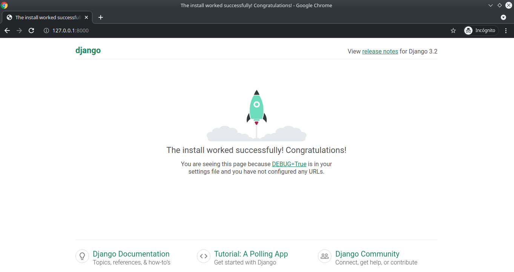
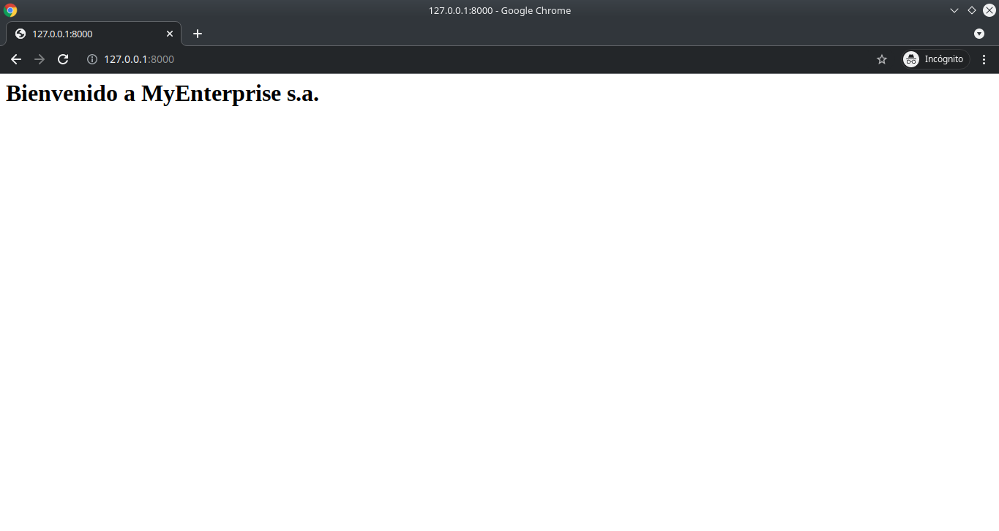

# Guía para creación de proyecto en Django

El presente documento servirá como una guía rápida para la creación de proyectos utilizando el framework Django utilizando los elementos básicos del mismo.
Instalación probada sobre entorno Ubuntu 20.04, python 3.8.8 y Django 3.2.4

La estructura de esta guía se presenta a continuación:

<div id="indice" />

**Índice**
1. [Creación de un entorno virtual](#paso1)
2. [Instalación de Django sobre entorno virtual](#paso2)
3. [Creación de un nuevo proyecto](#paso3)
4. [Estructura de archivos](#paso4)
5. [Migración inicial](#paso5)
6. [Creación de vistas y enrutamiento](#paso6)
7. [Creación de aplicaciones](#paso7)
8. [Estructura de archivos de aplicaciones](#paso8)
9. [Vistas y enrutamiento en aplicaciones](#paso9)
10. [Plantillas](#paso10)
11. [Archivos estáticos](#paso11)
12. [GET y POST request](#paso12)
13. [Redireccionamiento](#paso13)
14. [Sesiones](#paso14)
15. [Django ORM](#paso15)
    1. [Django con PostgreSQL](#paso15_1)
    2. [Modelos](#paso15_2)
    3. [Migraciones](#paso15_3)
    4. [ORM](#paso15_4)
16. [Model Forms](#paso16)

**Anexos**
1. [Anexo1: PostgreSQL](#A1)
    1. [Instalación](#A1.1)
    2. [Comandos de uso común](#A1.2)
    3. [Roles](#A1.3)
    4. [Creación de Bases de datos](#A1.4)
    4. [Sentencias básicas SQL](#A1.5)
        1. [Insert](#A1.5.1)
        2. [Select](#A1.5.2)
        3. [Update](#A1.5.3)
        4. [Delete](#A1.5.4)
        5. [Join](#A1.5.5)
2. [Anexo2: MySQL](#A2)
    1. [Instalación](#A2.1)
    2. [Comandos de uso común](#A2.2)
    3. [Creación de Bases de datos](#A2.3)
    4. [Creación de tablas](#A2.4)
    4. [Sentencias básicas SQL](#A2.5)
        1. [Insert](#A2.5.1)
        2. [Select](#A2.5.2)
        3. [Update](#A2.5.3)
        4. [Delete](#A2.5.4)
        5. [Join](#A2.5.5)

---

<div id='paso1' />

## 1. Creación de un entorno virtual

En la carpeta donde se desee crear el nuevo entorno virtual

```console
$ python -m venv DjangoVenv
```

Esto creará un entorno virtual en la carpeta actual

```console
$ ls
DjangoVenv/
```

Activación del entorno virtual

```console
$ source DjangoVenv/bin/activate
(DjangoVenv) $ 
```

[Volver al índice](#indice)

---

<div id='paso2' />

## 2. Instalación de Django sobre entorno virtual

```console
(DjangoVenv)$ pip install Django
```

[Volver al índice](#indice)

---

<div id='paso3' />

## 3. Creación de un nuevo proyecto

En la carpeta donde se desee crear el nuevo proyecto

```console
(DjangoVenv)$ django-admin startproject MyEnterprise
```

Entrar a la carpeta del proyecto e iniciar projecto usando archivo *manage.py*

```console
(DjangoVenv)$ cd MyEnterprise/
(DjangoVenv)$ python manage.py runserver
Watching for file changes with StatReloader
Performing system checks...

System check identified no issues (0 silenced).

You have 18 unapplied migration(s). Your project may not work properly until you apply the migrations for app(s): admin, auth, contenttypes, sessions.
Run 'python manage.py migrate' to apply them.
June 17, 2021 - 05:36:41
Django version 3.2.4, using settings 'MyEnterprise.settings'
Starting development server at http://127.0.0.1:8000/
Quit the server with CONTROL-C.
```

Ingresamos a la url http://127.0.0.1:8000/ indicada para verificar el correcto funcionamiento del servidor



[Volver al índice](#indice)

---

<div id='paso4' />

## 4. Estructura de archivos

Al crear el nuevo proyecto Django, se crea la siguiente estructura de archivos y carpetas:

```
MyEnterprise/
│   manage.py
│   db.sqlite3    
│
└───MyEnterprise/
│   │   __init__.py
│   │   asgi.py
│   │   settings.py
│   │   urls.py
│   │   wsgi.py
```

**manage.py** : Script usado para crear aplicaciones, trabajar con base de datos e iniciar pruebas de desarrollo levantando servidor de pruebas.

**db.sqlite3**: Base de datos por omisión.

**\_\_init\_\_.py**: Archivo encargado de indicar que el presente directorio es un **paquete python** (archivo vacío)

**settings.py**: Archivo que almacena la información sobre las plantillas y base de datos. Debe ser modificado cada vez que se agrega una nueva aplicación.

**urls.py**: Script encargado de manejar las urls de nuestro sitio web.

**wsgi.py y asgi.py**: Archivos que operan como interfaces para subir nuestro proyecto a un servidor Web.


*Ref: Explicación basada en los sitios web https://developer.mozilla.org/es/docs/Learn/Server-side/Django/skeleton_website y https://www.askpython.com/django/django-app-structure-project-structure*


[Volver al índice](#indice)

---

<div id='paso5' />

## 5. Migración inicial

Django provee todos sus proyectos con algunas aplicaciones preinstaladas (ej. admin, auth, etc.). Estas aplicaciones, vienen con sus propios modelos, los cuales serán migrados a nuestra base de datos durante nuestra primera migración.

```console
(DjangoVenv)$ python manage.py migrate
Operations to perform:
  Apply all migrations: admin, auth, contenttypes, sessions
Running migrations:
  Applying contenttypes.0001_initial... OK
  Applying auth.0001_initial... OK
  Applying admin.0001_initial... OK
  Applying admin.0002_logentry_remove_auto_add... OK
  Applying admin.0003_logentry_add_action_flag_choices... OK
  Applying contenttypes.0002_remove_content_type_name... OK
  Applying auth.0002_alter_permission_name_max_length... OK
  Applying auth.0003_alter_user_email_max_length... OK
  Applying auth.0004_alter_user_username_opts... OK
  Applying auth.0005_alter_user_last_login_null... OK
  Applying auth.0006_require_contenttypes_0002... OK
  Applying auth.0007_alter_validators_add_error_messages... OK
  Applying auth.0008_alter_user_username_max_length... OK
  Applying auth.0009_alter_user_last_name_max_length... OK
  Applying auth.0010_alter_group_name_max_length... OK
  Applying auth.0011_update_proxy_permissions... OK
  Applying auth.0012_alter_user_first_name_max_length... OK
  Applying sessions.0001_initial... OK
```

[Volver al índice](#indice)

---

<div id='paso6' />

## 6. Creación de vistas y enrutamiento

Dentro de nuestro proyecto, en la carpeta *MyEnterprise/MyEnterprise/*, agregar el archivo *views.py*. Este definirá las vistas de nuestro proyecto.

```console
(DjangoVenv)$ cd MyEnterprise/
(DjangoVenv)$ touch views.py
```

Dentro de *views.py* crearemos las funciones encargadas de cada una de las vistas

```python
# MyEnterprise/views.py

from django.shortcuts import HttpResponse

# Funciones para el manejo de vistas

def index(request):
    return HttpResponse('<h1>Bienvenido a MyEnterprise s.a.</h1>')
```

Esta vista será asociada a una url en el proyecto. Para esto, modificaremos el archivo *urls.py*.

```python
# MyEnterprise/urls.py

from django.contrib import admin
from django.urls import path
from MyEnterprise import views # Import agregado

urlpatterns = [
    path('admin/', admin.site.urls),
    path('', views.index), # Path agregado
]
```

Ejecutamos nuevamente nuestro servidor para verificar que la nueva vista ha sido agregada

```console
(DjangoVenv)$ python manage.py runserver
```



**TODO**: Hacer enrutamiento con parámetros

[Volver al índice](#indice)

---

<div id='paso7' />

## 7. Creación de aplicaciones

Nuestro proyecto puede contar con una o más aplicaciones. Para crear una nueva aplicación, tenemos que ejecutar el script *manage.py* como se muestra a continuación

```console
(DjangoVenv)$ python manage.py startapp App1
```

Luego, debemos *instalar* la aplicación en nuestro proyecto. Para ello, modificaremos el script *settings.py* de nuestro proyecto para agregar la nueva aplicación a nuestro proyecto

```python
# MyEnterprise/settings.py

...

# Application definition
INSTALLED_APPS = [
    'App1', # Se agrega la App1 a nuestras aplicaciones instaladas
    'django.contrib.admin',
    'django.contrib.auth',
    'django.contrib.contenttypes',
    'django.contrib.sessions',
    'django.contrib.messages',
    'django.contrib.staticfiles',
]

...

```

[Volver al índice](#indice)

---

<div id='paso8' />

## 8. Estructura de archivos de aplicaciones

Al crear una nueva aplicación Django, se actuliza la estructura de archivos y carpetas de nuestro proyecto de la siguiente manera:

```
MyEnterprise/
│   manage.py
│   db.sqlite3    
│
└───MyEnterprise/
│   │   __init__.py
│   │   asgi.py
│   │   settings.py
│   │   urls.py
│   │   views.py
│   │   wsgi.py
│   │
└───App1/
│   └───migrations/
│   │   __init__.py
│   │   admin.py
│   │   apps.py
│   │   models.py
│   │   tests.py
│   │   views.py
```

**\_\_init\_\_.py**: Archivo solo presente para indicar que el directorio es un paquete python.

**admin.py**: Archivo encargado de registrar los modelos que creemos en nuestro administrador de Django.

**apps.py**: Archivo encargado de la configuración de la aplicación.

**models.py**: Script que contiene el modelo de nuestra aplicación.

**tests.py**: Archivo que contiene los casos de prueba de nuestro sitio.

**views.py**: Script que contiene todas las funciones asociadas con las vistas de nuestra aplicación.

[Volver al índice](#indice)

---

<div id='paso9' />

## 9. Vistas y enrutamiento en aplicaciones

Editaremos el archivo de *views.py* de nuestra aplicación *App1/* para agregar una nueva vista.

```python
# App1/views.py
from django.shortcuts import render, HttpResponse

# Create your views here.
def index(request):
  return HttpResponse("<h1> Bienvenido a la primera aplicación de MyEnterprise</h1>")
```

Luego, en la carpeta de nuestra aplicación *App1/*, crearemos un archivo *urls.py* y luego lo modificaremos para asociar la vista con su respectiva url *dentro de la aplicación*.

```console
(DjangoVenv)$ cd App1/
(DjangoVenv)$ touch urls.py
```

```python
# App1/urls.py
from django.urls import path
from App1 import views

urlpatterns = [
    path('',views.index),
]

```

Luego, debemos agregar en nuestro proyecto las urls definidas dentro de nuestra aplicación. Para esto, modificaremos el archivo *urls.py* de nuestro proyecto.

```console
(DjangoVenv)$ cd MyEnterprise/
```

```python
# MyEnterprise/urls.py
from django.contrib import admin
from django.urls import path, include # include agregado 
from MyEnterprise import views

urlpatterns = [
    path('admin/', admin.site.urls),
    path('', views.index),
    path('app1/', include('App1.urls')), # Agregamos las urls de App1 a la url raíz app1/
]
```

[Volver al índice](#indice)

---

<div id='paso10' />

## 10. Plantillas y paso de datos

Django permite utilizar plantillas .html creadas por el desarrollador al momento de renderizar la vista. Estas plantillas deben encontrarse dentro de una carpeta *templates/*. Crearemos esta carpeta dentro de nuestra aplicación con una primera plantilla html.

```console
(DjangoVenv)$ cd App1/
(DjangoVenv)$ mkdir templates/
(DjangoVenv)$ touch templates/index.html
```

```html
<!--App1/templates/index.html-->
<!DOCTYPE html>
<html lang="en">
  <head>
    <meta charset="UTF-8" />
    <meta http-equiv="X-UA-Compatible" content="IE=edge" />
    <meta name="viewport" content="width=device-width, initial-scale=1.0" />
    <title>Bienvenido a App1</title>
  </head>
  <body>
    <h1>Bienvenido a App1: Una aplicación de My Enterprise</h1>
  </body>
</html>
```

Luego, la plantilla debe ser utilizada en una vista. Esta vista debe *renderizar* la plantilla. Modificaremos el archivo *views.py* de nuestra aplicación para agregar la plantilla a la vista. 

```python
# App1/views.py
from django.shortcuts import render, HttpResponse

# Create your views here.
def index(request):
  return render(request, "index.html") # Utilizamos la función render
```

Para pasar datos a una plantilla, debemos crear una variable de contexto. Esta variable es un diccionario python que contiene la información a ser pasada a la plantilla. Modificaremos nuestra vista para entregarle algunos parámetros

```python
# App1/views.py
from django.shortcuts import render, HttpResponse

# Create your views here.
def index(request):
  # Creamos un diccionario de contexto
  context = {
    'nombre': 'Optimus Prime',
    'pos_cargo': 1,
    'amigos': ['Bumblebee', 'Ratchet', 'Ironhide']
  }
  return render(request, "index.html", context) # Entregamos el contexto a nuestra plantilla
```

A continuación, modificaremos nuestra plantilla para recibir los parámetros enviados a través de nuestro contexto.

```html
<!--App1/templates/index.html-->
<!DOCTYPE html>
<html lang="en">
  <head>
    <meta charset="UTF-8" />
    <meta http-equiv="X-UA-Compatible" content="IE=edge" />
    <meta name="viewport" content="width=device-width, initial-scale=1.0" />
    <title>Bienvenido a App1</title>
    
    <link rel="stylesheet" href="">
  </head>
  <body>
    <h1>Bienvenido a App1: Una aplicación de My Enterprise</h1>
    <p>Nombre: {{nombre}}</p>
    <p>Posición del cargo {{pos_cargo}}</p>
    <p>Amigos</p>
    <ul>
    
        <li>{{amigo}}</li>
    
    </ul>
  </body>
</html>


```

[Volver al índice](#indice)

---

<div id='paso11' />

## 11. Archivos estáticos

Django permite agregar archivos estáticos (css, javascripts, imágenes, etc.) con una organización similar a las plantillas. Estos archivos deben encontrarse en una carpeta llamada *static/* dentro de nuestra aplicación. Dentro de esta carpeta *static/*, agregaremos las carpetas *css/*, *js/* e *images/* asociados a los archivos css, javascript e imágenes respectivamente.

```console
(DjangoVenv)$ cd App1/
(DjangoVenv)$ mkdir static/
(DjangoVenv)$ mkdir static/css/
(DjangoVenv)$ mkdir static/js/
(DjangoVenv)$ mkdir static/images/
```

Crearemos un archivo de estilo en nuestra carpeta *static/css/*

```console
(DjangoVenv)$ touch static/css/estilo.css
```

```css
/* static/css/estilo.css */
h1 {
  border: 2px solid red;
  background-color: green;
}
```

Modificaremos nuestra plantilla para agregar el estilo creado
```html
<!--App1/templates/index.html-->
<!DOCTYPE html>
<html lang="en">
  <head>
    <meta charset="UTF-8" />
    <meta http-equiv="X-UA-Compatible" content="IE=edge" />
    <meta name="viewport" content="width=device-width, initial-scale=1.0" />
    <title>Bienvenido a App1</title>
    
    <link rel="stylesheet" href="">
  </head>
  <body>
    <h1>Bienvenido a App1: Una aplicación de My Enterprise</h1>
  </body>
</html>
```

[Volver al índice](#indice)

---

<div id='paso12' />

## 12. GET y POST request

Crearemos una nueva vista que reciba request *GET* y *POST*. Para ello, utilizaremos el parámetro de entrada de nuestra vista *request*. Utilizando esta variable, podremos determinar qué tipo de solicitud ha sido enviada y cuales son los datos enviados en dicha solicitud.
Modificaremos el archivo *views.py* de nuestra aplicación para la creación de la nueva vista de solicitudes y para una vista adicional para un formulario que genere solicitudes de tipo *POST*.

```python
# App1/views.py
from django.shortcuts import render, redirect

# Create your views here.

def index(request):
    context = {
        'nombre': 'Optimus Prime',
        'pos_cargo': 1,
        'amigos': ['Bumblebee', 'Ratchet', 'Ironhide']
    }
    return render(request, 'index.html', context)


def solicitudes(request): # Vista que detecta solicitudes GET y POST
    context = {}
    if request.method == "GET":
        print("Se detectó una solicitud GET")
        print(request.GET)
        context['solicitud'] = 'GET'
    elif request.method == "POST":
        print("Se detectó una solicitud POST")
        print(request.POST)
        context['solicitud'] = 'POST'
    return render(request,"solicitudes.html", context)

def form(request): # Vista para formulario que genera solicitudes POST
    return render(request,"form.html")
```

Para cada una de estas vistas, crearemos una plantilla

```html
<!--App1/templates/solicitudes.html-->
<!DOCTYPE html>
<html lang="en">
<head>
    <meta charset="UTF-8">
    <meta http-equiv="X-UA-Compatible" content="IE=edge">
    <meta name="viewport" content="width=device-width, initial-scale=1.0">
    <title>Solicitud App1</title>
</head>
<body>
    <h1>La solicitud recibida es de tipo {{solicitud}}</h1>
</body>
</html>
```

**Ojo:** En el formulario de envío de solicitudes tipo *POST*, es necesario agregar el token CSRF. Esto se usa para evitar falsificaciones en el envío de datos de formularios.

```html
<!--App1/templates/form.html-->
<!DOCTYPE html>
<html lang="en">
<head>
    <meta charset="UTF-8">
    <meta http-equiv="X-UA-Compatible" content="IE=edge">
    <meta name="viewport" content="width=device-width, initial-scale=1.0">
    <title>Formulario POST</title>
</head>
<body>
    <form action="/app1/solicitudes/" method="post">
         
        <p>Nombre:</p>
        <input type='text' name='nombre'>
        <p>Posición cargo:</p>
        <input type='number' min=1 max=10 name='pos_cargo'>
        <button type='submit'>Nuevo usuario</button>
    </form>
</body>
</html>
```

Luego, en nuestro archivo *urls.py* dentro de nuestra aplicación, agregaremos las asociaciones entre plantillas y vistas creadas.

```python
# App1/urls.py
from django.urls import path
from App1 import views

urlpatterns = [
    path('',views.index),
    path('solicitudes/',views.solicitudes),
    path('formulario/',views.form),
]
```

[Volver al índice](#indice)

---

<div id='paso13' />

## 13. Redireccionamiento

Django provee dentro de sus bibliotecas la función *redirect*, la cual permite redirigir el tráfico entre vistas. Modificaremos la vista de solicitudes para que realice una redirección en caso de detectar un request de tipo *GET*.

```python
# App1/views.py
from django.shortcuts import render, redirect # Importamos la función redirect

# Create your views here.
def index(request):
    context = {
        'nombre': 'Optimus Prime',
        'pos_cargo': 1,
        'amigos': ['Bumblebee', 'Ratchet', 'Ironhide']
    }
    return render(request, 'index.html', context)


def solicitudes(request): 
    context = {}
    if request.method == "GET":
        # Al detectar un request de tipo GET, se redirige el tráfico a la vista
        # asociada a la URL "/" dentro de "app1" (es decir /app1/)
        return redirect("/app1") 
    elif request.method == "POST":
        print("Se detectó una solicitud POST")
        print(request.POST)
        context['solicitud'] = 'POST'
    return render(request,"solicitudes.html", context)

def form(request): # Vista para formulario que genera solicitudes POST
    return render(request,"form.html")
```

[Volver al índice](#indice)

---

<div id='paso14' />

## 14. Sesiones

Las variables de sesión son aquellas que permiten almacenar estados asociados a la conexión HTTP realizada sobre nuestro servidor. Las variables de sesión (aquellas que almacenarán este estado), se crean a partir de las solicitudes recibidas en cada vista a través del parámetro de entrada *request* definido para las funciones de manejo de vista.

Crearemos una variable de sesión para verificar que las conexión siempre partan desde la ruta asociada a la vista *index*.

```html
<!--App1/templates/index.html-->
<!DOCTYPE html>
<html lang="en">
  <head>
    <meta charset="UTF-8" />
    <meta http-equiv="X-UA-Compatible" content="IE=edge" />
    <meta name="viewport" content="width=device-width, initial-scale=1.0" />
    <title>Bienvenido a App1</title>
    
    <link rel="stylesheet" href="">
  </head>
  <body>
    <h1>Bienvenido a App1: Una aplicación de My Enterprise</h1>
    <p>Nombre: {{nombre}}</p>
    <p>Posición del cargo {{pos_cargo}}</p>
    <p>Amigos</p>
    <ul>
    
        <li>{{amigo}}</li>
    
    </ul>
  </body>
</html>
```

```html
<!--App1/templates/form.html-->
<!DOCTYPE html>
<html lang="en">
<head>
    <meta charset="UTF-8">
    <meta http-equiv="X-UA-Compatible" content="IE=edge">
    <meta name="viewport" content="width=device-width, initial-scale=1.0">
    <title>Formulario POST</title>
</head>
<body>
    <h1>Página con sesión de {{nombre}}</h1>
    <form action="/app1/solicitudes/" method="post">
        
        <p>Nombre:</p>
        <input type='text' name='nombre'>
        <p>Posición cargo:</p>
        <input type='number' min=1 max=10 name='pos_cargo'>
        <button type='submit'>Nuevo usuario</button>
    </form>
</body>
</html>
```

```html
<!--App1/templates/solicitudes.html-->
<!DOCTYPE html>
<html lang="en">
<head>
    <meta charset="UTF-8">
    <meta http-equiv="X-UA-Compatible" content="IE=edge">
    <meta name="viewport" content="width=device-width, initial-scale=1.0">
    <title>Solicitud App1</title>
</head>
<body>
    <h1>Página con sesión de {{nombre}}</h1>
    <h1>La solicitud recibida es de tipo {{solicitud}}</h1>
</body>
</html>
```

```python
# App1/views.py
from django.shortcuts import render, redirect

# Create your views here.

def index(request):
    context = {
        'nombre': 'Optimus Prime',
        'pos_cargo': 1,
        'amigos': ['Bumblebee', 'Ratchet', 'Ironhide']
    }
    request.session['nombre'] = context['nombre'] # Se crea la variable de sesión con un nombre
    return render(request, 'index.html', context)

def solicitudes(request): 
    # Si variable de sesión no fue creada, se redirige tráfico a index de app1
    if request.session.get("nombre") == None: 
        return redirect("/app1")
    context = {
        'nombre': request.session.get("nombre")
    }
    elif request.method == "POST":
        print("Se detectó una solicitud POST")
        print(request.POST)
        context['solicitud'] = 'POST'
    return render(request,"solicitudes.html", context)

def form(request):
    # Si variable de sesión no fue creada, se redirige tráfico a index de app1
    if request.session.get("nombre") == None:
        return redirect("/app1")
    context = {
        'nombre': request.session.get("nombre")
    }
    return render(request,"form.html", context)
```


[Volver al índice](#indice)

---

<div id='paso15' />

## 15. Django ORM

<div id='paso15_1' />

### 15.1 Django con PostgreSQL y MySQL


* Instalación biblioteca Python

Se debe instalar la biblioteca Python *psycopg2* para la conexión con Postgre

```console
(DjangoVenv)$ pip install psycopg2
```

Luego, se debe cambiar la configuración de la base de datos que usará Django en el archivo *settings.py* de nuestro proyecto (puede revisar la documentación de Django para múltiples bases de datos https://docs.djangoproject.com/en/3.2/topics/db/multi-db/).

```python
# MyEnterprise/settings.py

DATABASES = {
    'default': {
        'ENGINE': 'django.db.backends.postgresql',
        'NAME': 'myenterprise', # nombre de la base de datos, se creará en el servidor de Postgres a continuación
        'USER': 'postgres', # postgres para macOS o 'USER': 'postgres', para Windows
        'PASSWORD': '123456', # contraseña a la que la cambió al instalar Postgres
        'HOST': '127.0.0.1', # dirección IP localhost
        'PORT': '5432', # puerto del servidor postgres predeterminado
    }
}
```

En el caso de utilizar MySQL, se debe instalar la biblioteca *mysqlclient*

```console
(DjangoVenv)$ pip install mysqlclient
```

Finalmente, con las configuraciones hechas, se deben cargar las migraciones iniciales usando *manage.py*.

```python
(DjangoVenv)$ python manage.py migrate
Operations to perform:
  Apply all migrations: admin, auth, contenttypes, sessions
Running migrations:
  Applying contenttypes.0001_initial... OK
  Applying auth.0001_initial... OK
  Applying admin.0001_initial... OK
  Applying admin.0002_logentry_remove_auto_add... OK
  Applying admin.0003_logentry_add_action_flag_choices... OK
  Applying contenttypes.0002_remove_content_type_name... OK
  Applying auth.0002_alter_permission_name_max_length... OK
  Applying auth.0003_alter_user_email_max_length... OK
  Applying auth.0004_alter_user_username_opts... OK
  Applying auth.0005_alter_user_last_login_null... OK
  Applying auth.0006_require_contenttypes_0002... OK
  Applying auth.0007_alter_validators_add_error_messages... OK
  Applying auth.0008_alter_user_username_max_length... OK
  Applying auth.0009_alter_user_last_name_max_length... OK
  Applying auth.0010_alter_group_name_max_length... OK
  Applying auth.0011_update_proxy_permissions... OK
  Applying auth.0012_alter_user_first_name_max_length... OK
  Applying sessions.0001_initial... OK
```

<div id='paso15_2' />

### 15.2 Modelos

Crearemos un modelo que será cargado en nuestra base de datos. Cada modelo está representado por una **clase Python** en nuestro archivo *models.py* dentro de nuestra aplicación. Para que Django la identifique como un modelo de base de datos, se le debe indicar que hereda de la clase *models.Model*

```python
# App1/models.py
from django.db import models

class Cliente(models.Model):
    # id se crea automáticamente
    nombre = models.CharField(max_length=50)
    run = models.IntegerField()
    dv = models.IntegerField()

class Cuentas(models.Model):
    idCliente = models.ForeignKey(Cliente, on_delete=models.CASCADE) # Llave foránea a clientes
    n_cuenta = models.IntegerField()
    saldo = models.FloatField()

```

<div id='paso15_3' />

### 15.3 Migraciones

Una vez creado el modelo, este debe ser cargado a la base de datos. Este proceso se realiza con *migraciones*.

```console
(DjangoVenv)$ python manage.py makemigrations
(DjangoVenv)$ python manage.py migrate
```

Mientras que **makemigrations** revisa las actualizaciones que se han hecho sobre el modelo, **migrate** aplica los cambios sobre la base de datos.

<div id='paso15_4' />

### 15.4 ORM

Un Object-Relational-Mapping (ORM) permite acceder a una base de datos, con sus datos y estructura, usando programación orientada a objetos. Cada objeto está asociado con un dato y cada método está asociado con una sentencia SQL (para ver más de sentencias SQL, revisar [Anexo1](#A1))

Manipularemos la Base de Datos a través de la Django Shell. Si bien, es posible usar directamente esta terminal, utilizaremos la terminal Python con funcionalidades extendidas llamada *IPython*.

* Instalación de *IPython*.

```console
(DjangoVenv)$ pip install ipython
```

* Ejecución de la Django Shell 

```python
(DjangoVenv)$ python manage.py shell
Python 3.8.8 (default, Feb 24 2021, 21:46:12) 
Type 'copyright', 'credits' or 'license' for more information
IPython 7.22.0 -- An enhanced Interactive Python. Type '?' for help.

In [1]: 
```

* Creación de datos

```python
In [1]: from App1.models import * # Se importan los modelos creados
In [2]: cliente1 = Cliente.objects.create(nombre="Damián", run=11111111, dv=1) # Nuevo cliente
In [3]: cuenta1_1 = Cuentas.objects.create(idCliente=cliente1, 
                    n_cuenta="153489", saldo=10000) # Creación de nueva cuenta
In [4]: cuenta1_2 = Cuentas.objects.create(idCliente=cliente1,
                    n_cuenta="64895642", saldo=50000) # Cuenta adicional
```

Métodos ORM provistos en Django pueden ser revisados en la plataforma Coding Dojo y en la documentación de Django (https://docs.djangoproject.com/en/3.2/topics/db/models/)

* Ejemplo 

[Volver al índice](#indice)

---

<div id='A1' />

## Anexo1: PostgreSQL

<div id='A1.1' />

### A1.1 Instalación

```console
(DjangoVenv)$ sudo apt install postgresql postgresql-contrib
```

(Revisar plataforma de Coding Dojo para otros sistemas operativos)

<div id='A1.2' />

### A1.2 Comandos de uso común 

(Referencia: https://gist.github.com/Kartones/dd3ff5ec5ea238d4c546)

Magic words:

```bash
psql -U postgres
```

Some interesting flags (to see all, use `-h` or `--help` depending on your psql version):
- `-E`: will describe the underlaying queries of the `\` commands (cool for learning!)
- `-l`: psql will list all databases and then exit (useful if the user you connect with doesn't has a default database, like at AWS RDS)

Most `\d` commands support additional param of `__schema__.name__` and accept wildcards like `*.*`

- `\?`: Show help (list of available commands with an explanation)
- `\q`: Quit/Exit
- `\c __database__`: Connect to a database
- `\d __table__`: Show table definition (columns, etc.) including triggers
- `\d+ __table__`: More detailed table definition including description and physical disk size
- `\l`: List databases
- `\dy`: List events
- `\df`: List functions
- `\di`: List indexes
- `\dn`: List schemas
- `\dt *.*`: List tables from all schemas (if `*.*` is omitted will only show SEARCH_PATH ones)
- `\dT+`: List all data types
- `\dv`: List views
- `\dx`: List all extensions installed
- `\df+ __function__` : Show function SQL code. 
- `\x`: Pretty-format query results instead of the not-so-useful ASCII tables
- `\copy (SELECT * FROM __table_name__) TO 'file_path_and_name.csv' WITH CSV`: Export a table as CSV
- `\des+`: List all foreign servers
- `\dE[S+]`: List all foreign tables
- `\! __bash_command__`: execute `__bash_command__` (e.g. `\! ls`)

User Related:
- `\du`: List users
- `\du __username__`: List a username if present.
- `create role __test1__`: Create a role with an existing username.
- `create role __test2__ noinherit login password __passsword__;`: Create a role with username and password.
- `set role __test__;`: Change role for current session to `__test__`.
- `grant __test2__ to __test1__;`: Allow `__test1__` to set its role as `__test2__`.
- `\deu+`: List all user mapping on server

<div id='A1.3' />

### A1.3 Roles

PostgreSQL trabaja con roles. Durante la instalación, se creó automáticamente el rol *postgres*.

```console
(DjangoVenv)$ sudo --login --user=postgres
postgres@localhost$ 
```

<div id='A1.4' />

### A1.4 Creación de Base de datos

```console
postgres@localhost$ psql
Type "help" for help.

postgres=# create database myenterprise;
CREATE DATABASE
postgres=# \l
                                   List of databases
     Name     |  Owner   | Encoding |   Collate   |    Ctype    |   Access privileges   
--------------+----------+----------+-------------+-------------+-----------------------
 myenterprise | postgres | UTF8     | es_CL.UTF-8 | es_CL.UTF-8 | 
 postgres     | postgres | UTF8     | es_CL.UTF-8 | es_CL.UTF-8 | 
 template0    | postgres | UTF8     | es_CL.UTF-8 | es_CL.UTF-8 | =c/postgres          +
              |          |          |             |             | postgres=CTc/postgres
 template1    | postgres | UTF8     | es_CL.UTF-8 | es_CL.UTF-8 | =c/postgres          +
              |          |          |             |             | postgres=CTc/postgres
(4 rows)
postgres=# \c myenterprise
You are now connected to database "myenterprise" as user "postgres".
myenterprise=#
```

<div id='A1.5' />

### A1.5 Sentencias básicas SQL

Referencia: https://www.postgresqltutorial.com/

**Ojo:** PostgreSQL utiliza comillas dobles (") para identificadores de sistema y comillas simples (') para textos.

<div id='A1.5.1' />

#### **A1.5.1 Insert**

```sql
insert into nombre_tabla (columna1, columna2, columna3) values (valor1, valor2, valor3);
```

Ejemplo: 

```console
myenterprise=# insert into "App1_cliente" (nombre, run, dv) values ('Patricio', 11111111, 1), ('Juan', 2222222, 2);
INSERT 0 2
```

<div id='A1.5.2' />

#### **A1.5.2 Select**

```sql
select columna1, columna2 from nombre_tabla where condición;
```

Ejemplo: 

```console
myenterprise=# select run from "App1_cliente" where nombre='Patricio';
   run    
----------
 11111111
(1 row)

```

<div id='A1.5.3' />

#### **A1.5.3 Update**

```sql
update nombre_tabla set columna1=valor1 and columna2=valor2 where columna3=valor3;

```

Ejemplo: 

```console
myenterprise=# update "App1_cliente" set nombre='Patricio Olivares' where run=11111111;
UPDATE 1
myenterprise=# select * from "App1_cliente";
 id |      nombre       |   run    | dv 
----+-------------------+----------+----
  2 | Juan              |  2222222 |  2
  1 | Patricio Olivares | 11111111 |  1
(2 rows)
```

<div id='A1.5.4' />

#### **A1.5.4 Delete**

```sql
delete from nombre_tabla where condicion;

```

Ejemplo: 

```console
myenterprise=# delete from "App1_cliente" where run=11111111;
DELETE 1
myenterprise=# select * from "App1_cliente";
 id | nombre |   run   | dv 
----+--------+---------+----
  2 | Juan   | 2222222 |  2
(1 row)
```

<div id='A1.5.5' />

#### **A1.5.5 Join**

Join permite combinar datos entre tablas que tengan una o más columnas en común. El Join puede ser de tipo

1. **Inner Join:** Devuelve los datos que se encuentren en ambas columnas (intersección)
2. **Left Join:** Agrega a la tabla de la izquierda la información contenida en la tabla derecha.
3. **Right Join:** Agrega a la tabla de la detecha la información contenida en la tabla izquierda.

Ejemplo:

```console
myenterprise=# insert into "App1_cliente" (nombre, run, dv) values ('Alfonso', 33333333, 3), ('Constanza', 44444444, 4);
INSERT 0 2
myenterprise=# insert into "App1_cuenta" (n_cuenta, saldo, cliente_id) values (1, 10000, 2), (2, 10000, 2), (3, 50000, 3);
INSERT 0 3
myenterprise=# select nombre, run, n_cuenta, saldo from "App1_cliente" join "App1_cuenta" on "App1_cliente".id=cliente_id;
 nombre  |   run    | n_cuenta | saldo 
---------+----------+----------+-------
 Juan    |  2222222 |        1 | 10000
 Juan    |  2222222 |        2 | 10000
 Alfonso | 33333333 |        3 | 50000
(3 rows)
myenterprise=# select nombre, run, n_cuenta, saldo from "App1_cliente" left join "App1_cuenta" on "App1_cliente".id=cliente_id;
  nombre   |   run    | n_cuenta | saldo 
-----------+----------+----------+-------
 Juan      |  2222222 |        1 | 10000
 Juan      |  2222222 |        2 | 10000
 Alfonso   | 33333333 |        3 | 50000
 Constanza | 44444444 |          |      
(4 rows)
```

[Volver al índice](#indice)

<div id='A2' />
## Anexo1: MySQL

<div id='A2.1' />

### A2.1 Instalación

```console
(DjangoVenv)$ sudo apt install mysql-server
```

(Revisar plataforma de Coding Dojo para otros sistemas operativos)

<div id='A2.2' />

### A2.2 Comandos de uso común 

(Referencia: https://programmerclick.com/article/3885696599/)

Conexión
```bash
mysql -u root -p

// crear base de datos
create database name; 

 // Seleccione la base de datos
use databasename; 

 // Eliminar la base de datos directamente sin recordar
drop database name; 

 // mostrar tabla
show tables; 

 // Descripción detallada de la tabla.
describe tablename; 

 seleccionar agrega distinto para eliminar campos duplicados

 // Antes de eliminar la base de datos, hay un mensaje
mysqladmin drop databasename 

 // Muestra la versión actual de mysql y la fecha actual
select version(),current_date;

```

<div id='A1.3' />

### A1.3 Creación de Base de datos

```console
mysql@localhost$ mysql -u user -p
Enter password: 
Welcome to the MySQL monitor.  Commands end with ; or \g.
Your MySQL connection id is 14
Server version: 8.0.26-0ubuntu0.20.04.3 (Ubuntu)

Copyright (c) 2000, 2021, Oracle and/or its affiliates.

Oracle is a registered trademark of Oracle Corporation and/or its
affiliates. Other names may be trademarks of their respective
owners.

Type 'help;' or '\h' for help. Type '\c' to clear the current input statement.

mysql> create database myenterprise;
Query OK, 1 row affected (0,01 sec)

mysql> show databases;
+--------------------+
| Database           |
+--------------------+
| information_schema |
| myenterprise       |
| mysql              |
| performance_schema |
| sys                |
+--------------------+
5 rows in set (0,01 sec)

mysql> use myenterprise;
Database changed
mysql>
```

<div id='A2.4'>

### A2.4 Creación de tablas

```console
mysql> create table App1_cliente (id MEDIUMINT NOT NULL AUTO_INCREMENT, nombre VARCHAR(20), run BIGINT, dv INT, PRIMARY KEY (id));      
Query OK, 0 rows affected (0,08 sec)
mysql> desc App1_cliente;
+--------+-------------+------+-----+---------+----------------+
| Field  | Type        | Null | Key | Default | Extra          |
+--------+-------------+------+-----+---------+----------------+
| id     | mediumint   | NO   | PRI | NULL    | auto_increment |
| nombre | varchar(20) | YES  |     | NULL    |                |
| run    | bigint      | YES  |     | NULL    |                |
| dv     | int         | YES  |     | NULL    |                |
+--------+-------------+------+-----+---------+----------------+
4 rows in set (0,01 sec)

mysql> create table App1_cuenta(
    -> n_cuenta MEDIUMINT NOT NULL AUTO_INCREMENT,
    -> person_id MEDIUMINT NOT NULL,
    -> saldo int,
    -> PRIMARY KEY(n_cuenta),
    -> FOREIGN KEY(person_id) REFERENCES App1_cliente(id)
    -> );
Query OK, 0 rows affected (0,05 sec)

mysql> desc App1_cuenta;
+-----------+-----------+------+-----+---------+----------------+
| Field     | Type      | Null | Key | Default | Extra          |
+-----------+-----------+------+-----+---------+----------------+
| n_cuenta  | mediumint | NO   | PRI | NULL    | auto_increment |
| person_id | mediumint | NO   | MUL | NULL    |                |
| saldo     | int       | YES  |     | NULL    |                |
+-----------+-----------+------+-----+---------+----------------+
3 rows in set (0,02 sec)


```

<div id='A2.5' />

### A2.5 Sentencias básicas MySQL

Referencia: https://dev.mysql.com/doc/refman/8.0/en/sql-data-manipulation-statements.html


<div id='A2.5.1' />

#### **A2.5.1 Insert**

```sql
insert into nombre_tabla (columna1, columna2, columna3) values (valor1, valor2, valor3);
```

Ejemplo: 

```console
mysql> insert into App1_cliente (nombre, run, dv) values ('Patricio', 11111111, 1), ('Juan', 2222222, 2);
Query OK, 2 rows affected (0,01 sec)
Records: 2  Duplicates: 0  Warnings: 0

```

<div id='A2.5.2' />

#### **A2.5.2 Select**

```sql
select columna1, columna2 from nombre_tabla where condición;
```

Ejemplo:

```console
mysql> select run from App1_cliente where nombre="Patricio";
+----------+
| run      |
+----------+
| 11111111 |
+----------+
1 row in set (0,01 sec)


```

<div id='A2.5.3' />

#### **A2.5.3 Update**

```sql
update nombre_tabla set columna1=valor1 and columna2=valor2 where columna3=valor3;

```

Ejemplo: 

```console
mysql> update App1_cliente set nombre="Patricio Olivares" where run=11111111;
Query OK, 1 row affected (0,01 sec)
Rows matched: 1  Changed: 1  Warnings: 0

mysql> select * from App1_cliente;
+----+-------------------+----------+------+
| id | nombre            | run      | dv   |
+----+-------------------+----------+------+
|  1 | Patricio Olivares | 11111111 |    1 |
|  2 | Juan              |  2222222 |    2 |
+----+-------------------+----------+------+
2 rows in set (0,00 sec)
```

<div id='A2.5.4' />

#### **A2.5.4 Delete**

```sql
delete from nombre_tabla where condicion;

```

Ejemplo: 

```console
mysql> delete from App1_cliente where run=11111111;
Query OK, 1 row affected (0,01 sec)
mysql> select * from App1_cliente;
+----+--------+---------+------+
| id | nombre | run     | dv   |
+----+--------+---------+------+
|  2 | Juan   | 2222222 |    2 |
+----+--------+---------+------+
1 row in set (0,00 sec)

```

<div id='A2.5.5' />

#### **A2.5.5 Join**

Join permite combinar datos entre tablas que tengan una o más columnas en común. El Join puede ser de tipo

1. **Inner Join:** Devuelve los datos que se encuentren en ambas columnas (intersección)
2. **Left Join:** Agrega a la tabla de la izquierda la información contenida en la tabla derecha.
3. **Right Join:** Agrega a la tabla de la detecha la información contenida en la tabla izquierda.

Ejemplo:

```console
mysql> insert into App1_cliente (nombre, run, dv) values ('Alfonso', 33333333, 3), ('Constanza', 44444444, 4);
Query OK, 2 rows affected (0,01 sec)
Records: 2  Duplicates: 0  Warnings: 0

mysql> insert into App1_cuenta (n_cuenta, saldo, person_id) values (1, 10000, 2), (2, 10000, 2), (3, 50000, 3);
Query OK, 3 rows affected (0,01 sec)
Records: 3  Duplicates: 0  Warnings: 0

mysql> select nombre, run, n_cuenta, saldo from App1_cliente join App1_cuenta on App1_cliente.id=person_id;
+---------+----------+----------+-------+
| nombre  | run      | n_cuenta | saldo |
+---------+----------+----------+-------+
| Juan    |  2222222 |        1 | 10000 |
| Juan    |  2222222 |        2 | 10000 |
| Alfonso | 33333333 |        3 | 50000 |
+---------+----------+----------+-------+
3 rows in set (0,00 sec)

mysql> select nombre, run, n_cuenta, saldo from App1_cliente left join App1_cuenta on App1_cliente.id=person_id;
+-----------+----------+----------+-------+
| nombre    | run      | n_cuenta | saldo |
+-----------+----------+----------+-------+
| Juan      |  2222222 |        1 | 10000 |
| Juan      |  2222222 |        2 | 10000 |
| Alfonso   | 33333333 |        3 | 50000 |
| Constanza | 44444444 |     NULL |  NULL |
+-----------+----------+----------+-------+
4 rows in set (0,00 sec)

```

---